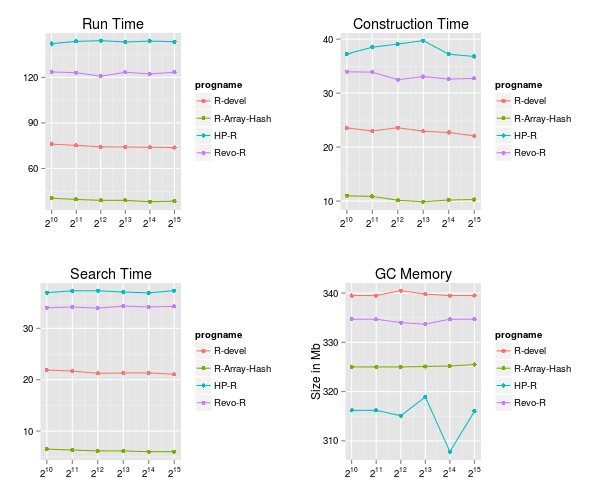
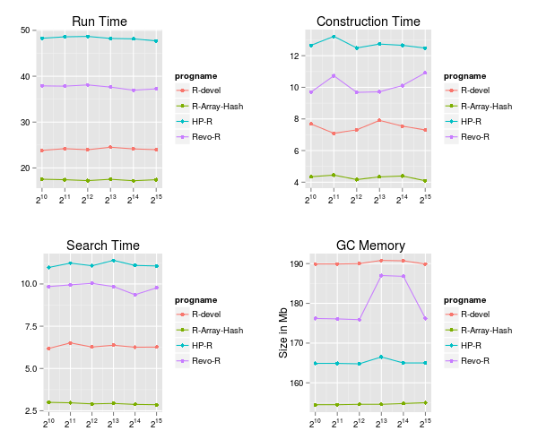
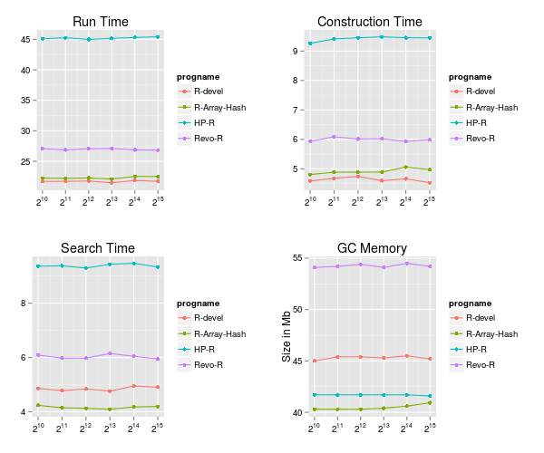

# Benchmark Design

Construction and search of a hashed R environment were measured against
various data sets. Also, the memory size of the hash table was measured
by using calls to the garbage collector as a proxy.  Four versions
of R were tested with three data sets and six hash sizes ranging from
2^10 to 2^15. Also 3 runs of each were performed for a total of 216
independent tests.

The benchmark was set up similarly to the design in Nikolas Askitis and Justin Zobel's paper ["Redesigning the String Hash Table, Burst Trie, and BST to Exploit Cache."](http://dl.acm.org/citation.cfm?id=1921704).

NOTE: Hash tables are key-value stores. In R, environmnents can be
used as key-value stores with a named variable acting as the key, and
obviously the value of the variable acting as the value of the key. Hashed
environments are constructed with *new.env(hash=TRUE)* and an additional
argument 'size' specifing the size of the hashed environment. This value
allocates 'size' [slots](http://en.wikipedia.org/wiki/Hash_table) for
the hash table.

# Data Sets

Large sets of words scraped from
[Wikipedia](https://github.com/jeffreyhorner/Wikipedia) articles were
created, one word per line.

There are two variants of the data sets, SKEW and DISTINCT. The SKEW
data sets obey [Zipf's law](http://en.wikipedia.org/wiki/Zipf%27s_law),
e.g. the most frequent word in the set will appear twice as likely as the
second most frequent word, etc, common in spoken langauge corpora. The
DISTINCT data set contains only distinct words, no repeats, and they
appear in the file in the order in which they were scraped, unordered.

Three data sets were tested: SKEW.1mil, DISTINCT.500thou, and DISTINCT.1mil

## SKEW.1mil

[SKEW.1mil](https://github.com/jeffreyhorner/Wikipedia/blob/master/SKEW.1mil) contains one million words with repeats, 63469 distinct words, with an average length of 5.11 letters.

## DISTINCT.500thou and DISTINCT.1mil

[DISTINCT.500thou](https://github.com/jeffreyhorner/Wikipedia/blob/master/DISTINCT.500thou) constains half a million unique words with an average length of 8.58 letters, and [DISTINCT.1mil](https://github.com/jeffreyhorner/Wikipedia/blob/master/DISTINCT.1mil) contains a million unique words, average length 8.73

# Construction and Search of the R Environment

Each run of [RUN.R](RUN.R) constructed a new hashed R environment and a random string value using:

```r
e <- new.env(hash=TRUE, size=hashsize)
val <- paste(sample(letters, size=7), collapse='')
```

The value was not important and was kept small so as not to add any
overhead cost.  Then, for each word in the data file an assignment was
made in the environment:

```r
assign(word, val, envir=e)
```

Once all words were assigned the file was read again one word at a
time, and the environment was searched with:

```r
get(word, envir=e)
```

# Measurements

So, what was measured? In Askitis and Zobel's paper, they measured the
total time it took to construct the hash table, the total time it took
to search the hash table, and the size in memory of the hash table given
varying hash sizes.

In RUN.R we measured those a little differently since R is an interpreted
language with a garbage collector versus C, a compiled language with no
memory manaagement overhead:

* 'Construct' time was the time it took to call *assign(var, value, envir=e)* for all words. 
* 'Search' time was the time it took to call *get(var,envir=e)* for all words, and 
* 'Runtime' was the time it took to both construct and search the R environment. 

The 'Runtime' measurement included the overhead of reading the files,
calls to the garbage collector, hash table resizes etc.

Finally, 

* 'Memory Size' was measured by using calls of *gc(reset=TRUE)* and then another call of *gc()* to create a proxy for the size of the environment in memory.

# Results

Results are very promising, with R-Array-Hash construction and search of a one million DISTINCT dataset performing faster than a comparative R-devel at SVN revision 67716, faster than Revolution R Enterprise 7.3.0, and faster that HP's new Distributed R.

Tests were performed in single user mode on a DELL PRECISION M6800 running Redhat Enterprise Linux version 6 with a 4 core Intel i7-4800MQ processer and clock speed of 2.70GHz, 8 GB main memory, and a hybrid SSD. 

* [results.RData](results.RData): R data file with 216 results.
* [analysis.R](analysis.R): Analysis of the results.
* [plots.R](plots.R): created the below plots.

For the plots below, the Y axis is time in seconds when the label is missing, and the X axis is the size of the hash table (and log scaled).

## DISTINCT.1mil



## DISTINCT.500thou



## SKEW.1mil


